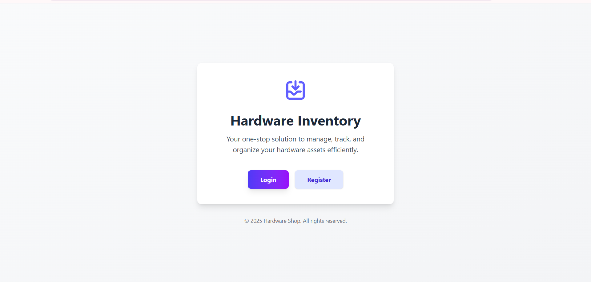
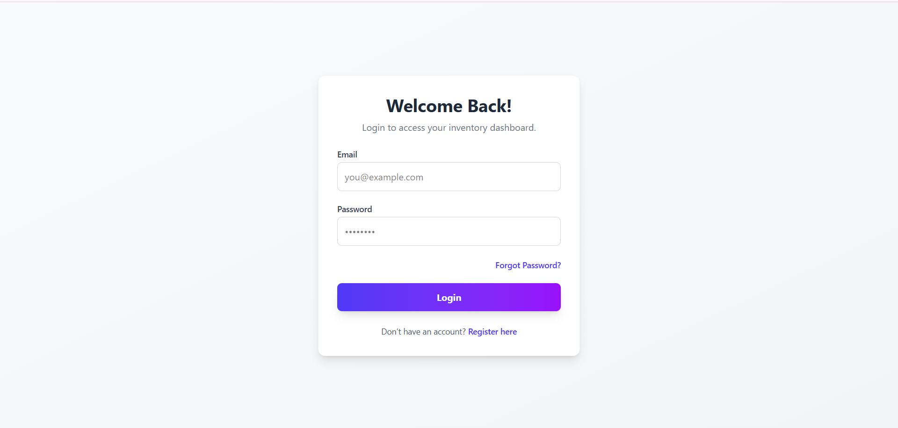
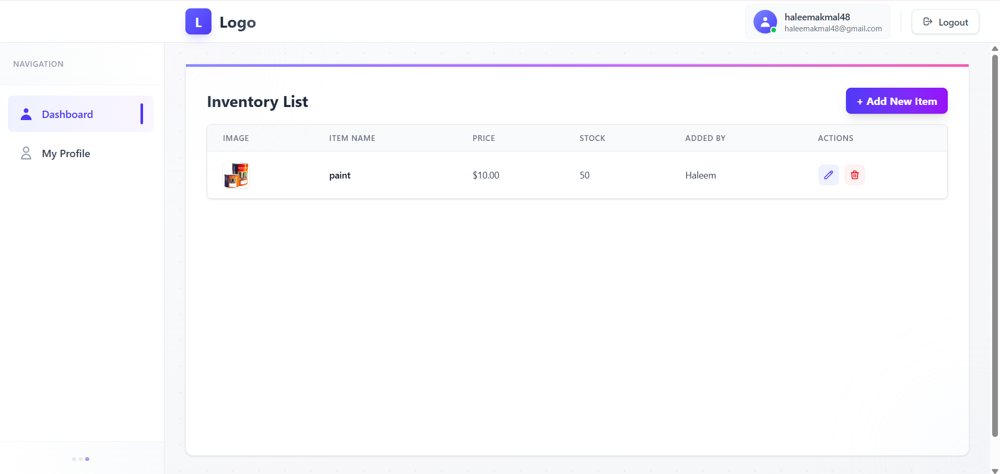
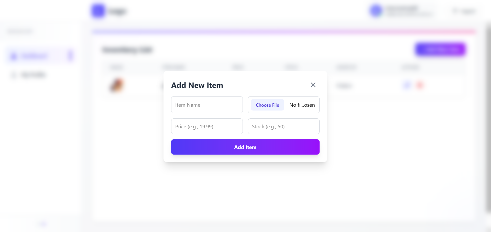
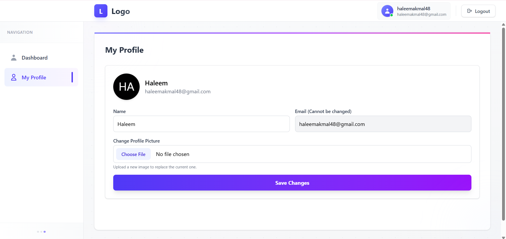

# MERN CRUD 

This is a full-stack MERN (MongoDB, Express, React, Node.js) web application designed for managing hardware shop inventory. This project has been migrated from local file uploads to support cloud-based storage using **Cloudinary** and is deployed live on the web.

## 🚀 Live Demo & Repository

* **Live (Vercel):** **[https://mern-crud-frontend-eight.vercel.app](https://mern-crud-frontend-eight.vercel.app)**
* **GitHub Repository:** **[https://github.com/haleem-akmal/mern-crud](https://github.com/haleem-akmal/mern-crud)**

## ✨ Features

* **User Authentication:**
    * New user registration.
    * **Email Activation:** Sends an activation link to new users via Nodemailer.
    * User Login with JSON Web Token (JWT).
    * **Password Reset:** A complete "Forgot Password" flow that emails a secure reset link.
* **Inventory Management (CRUD):**
    * Create new inventory items.
    * Read and list all items in a dashboard.
    * Update existing items.
    * Delete items from inventory.
* **Cloud Image Uploads:**
    * Uses Multer and `multer-storage-cloudinary` to upload item images **directly to Cloudinary** cloud storage.
* **Profile Management:**
    * Users can update their name and profile picture.
* **Protected Routes:**
    * Frontend routes (like Dashboard and Profile) are protected using a `PrivateRoute` component, requiring a valid JWT to access.
* **Architecture:**
    * The backend follows an **MVC (Model-View-Controller)** and **OOP (Class-based Services)** architecture for clean, scalable, and maintainable code.

## 📸 Screenshots

**(Note: To make this work, create a `screenshots` folder in your project's root, add your images, and push to GitHub. Then, update the paths below.)**

| Homepage | Register Page | Login Page |
| :---: | :---: | :---: |
|  |  |  |
| **Dashboard** | **Add/Edit Modal** | **Profile Page** |
|  |  |  |


## 🛠️ Tech Stack

| Area | Technology |
| :--- | :--- |
| **Frontend** | React (v19+), TypeScript, Vite, TailwindCSS, React Router (v7), Axios |
| **Backend** | Node.js, Express, TypeScript, MongoDB (Mongoose), JWT (jsonwebtoken), bcryptjs, Nodemailer, Cloudinary, Multer |

## ☁️ Deployment Architecture

This project is hosted using a **"Separate Deployment"** strategy:

* **Frontend (React + Vite):**
    * Hosted on **Vercel**.
    * Manages all user-facing pages and client-side routing.

* **Backend (Node.js + Express):**
    * Hosted on **Vercel (as Serverless Functions)** or **Render (as a Web Service)**.
    * Handles all API logic, database interactions, and authentication.

## 📁 Project Structure

This project is a **Monorepo** (Monolithic Repository), where the `frontend` and `backend` are separate projects living in the same repository.

```
MERN_CURD/
├── backend/        # Node.js / Express API
│   ├── src/
│   ├── package.json
│   └── tsconfig.json
└── frontend/       # React / Vite App
    ├── src/
    ├── package.json
    └── tsconfig.json
```


## 🚀 How to Run Locally

To run this project on your local machine, please follow the steps below.

### Prerequisites

* Node.js (v18 or higher)
* MongoDB (A local instance running or a MongoDB Atlas connection string)

### 1. Backend Setup

1.  Navigate to the backend directory:
    ```bash
    cd backend
    ```
2.  Install the dependencies:
    ```bash
    npm install
    ```
3.  Create a new file named `.env` in the `backend` folder.
4.  Copy the content below into your `.env` file and fill in your **actual values**.
    ```env
    # Server Port
    PORT=5000

    # MongoDB Connection
    MONGO_URI=YOUR_MONGODB_CONNECTION_STRING

    # Email Credentials (Nodemailer)
    EMAIL_HOST=smtp.gmail.com
    EMAIL_PORT=587
    EMAIL_USER=YOUR_GMAIL_ADDRESS
    EMAIL_PASS=YOUR_GMAIL_APP_PASSWORD

    # JWT Secrets (Use strong, random strings)
    JWT_SECRET=YOUR_RANDOM_JWT_SECRET
    JWT_ACTIVATION_SECRET=YOUR_RANDOM_ACTIVATION_SECRET
    JWT_RESET_SECRET=YOUR_RANDOM_RESET_SECRET

    # Backend URL
    BACKEND_URL=http://localhost:5000

    # Frontend URL (for CORS)
    FRONTEND_URL=http://localhost:5173

    # Cloudinary Credentials
    CLOUDINARY_CLOUD_NAME=YOUR_CLOUDINARY_CLOUD_NAME
    CLOUDINARY_API_KEY=YOUR_CLOUDINARY_API_KEY
    CLOUDINARY_API_SECRET=YOUR_CLOUDINARY_API_SECRET
    ```
5.  Start the backend development server:
    ```bash
    npm run dev
    ```
    (The server will be running on `http://localhost:5000`)

### 2. Frontend Setup

1.  Open a **new terminal**.
2.  Navigate to the frontend directory:
    ```bash
    cd frontend
    ```
3.  Install the dependencies:
    ```bash
    npm install
    ```
4.  Start the frontend development server:
    ```bash
    npm run dev
    ```
    (The app will be running on `http://localhost:5173`)
